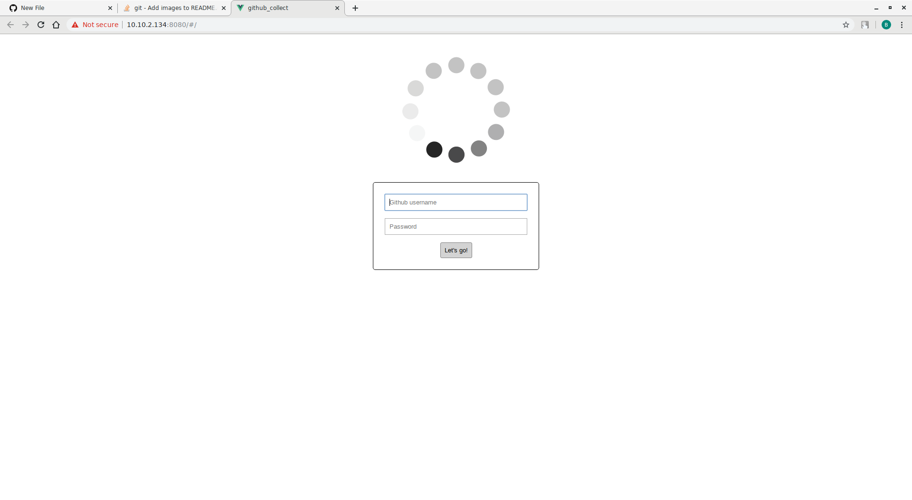
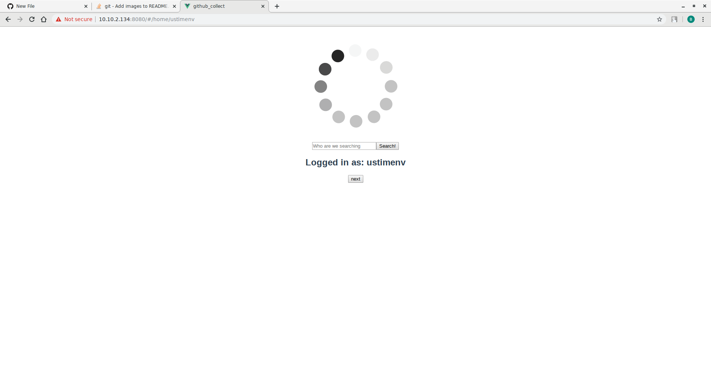
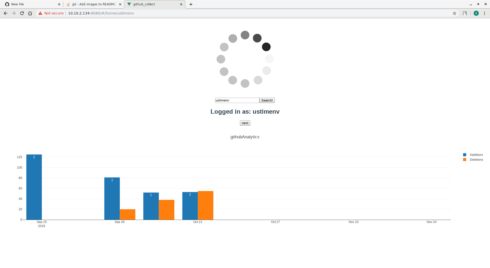
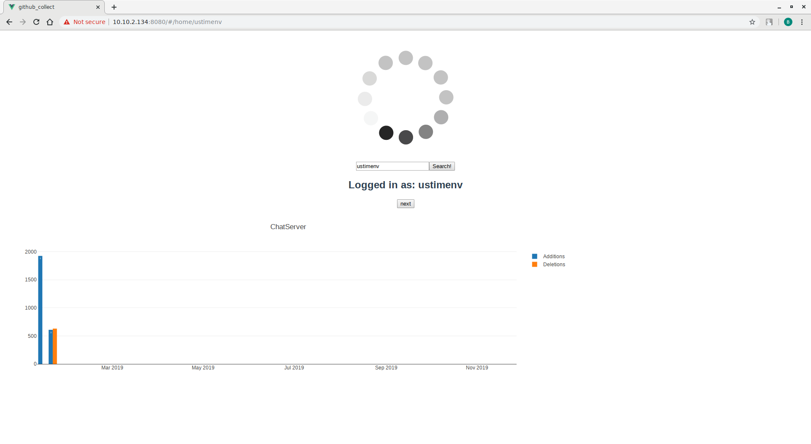
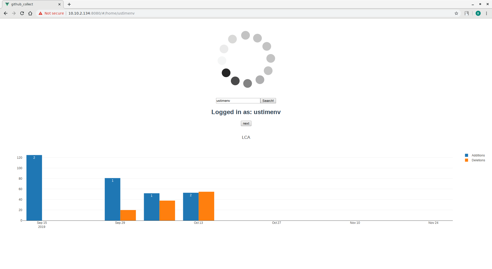
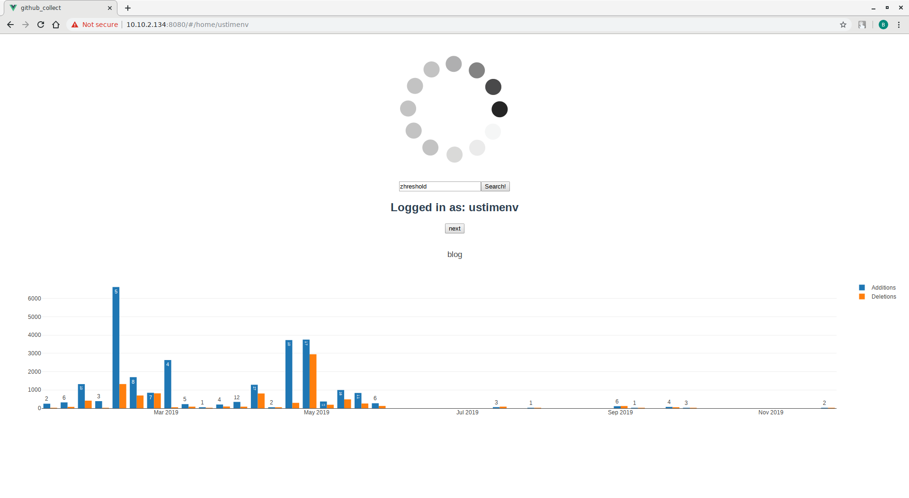

# githubAnalytics
# Github commits visualisation

## Project setup
```
npm install
```

This project was created as an assignment for CSU33012 of Trinity College Dublin.
At the start the user is able to login with their Github account to sign their queries to 
the API, thus allowing for up to 6000 queries per hour. Alternatively, create a .env file
with your personal Github API key. 

Having logged in, simply type in a github username in the search bar

As soon as the API response is received, you may cycle through the user's repositories,
provided we are allowed to see them). 
We display weekly additions versus deletions, with the number at the top of the bar 
indicating the number of commits made in the given week.

#Displaying currently logged in user





#Displaying a different user


Additionally, should you wish to collect the data for offline access, the collect.py script may be of help.
By recursively creating a directory tree, we may gather everything there is to know about a repository or a user.
